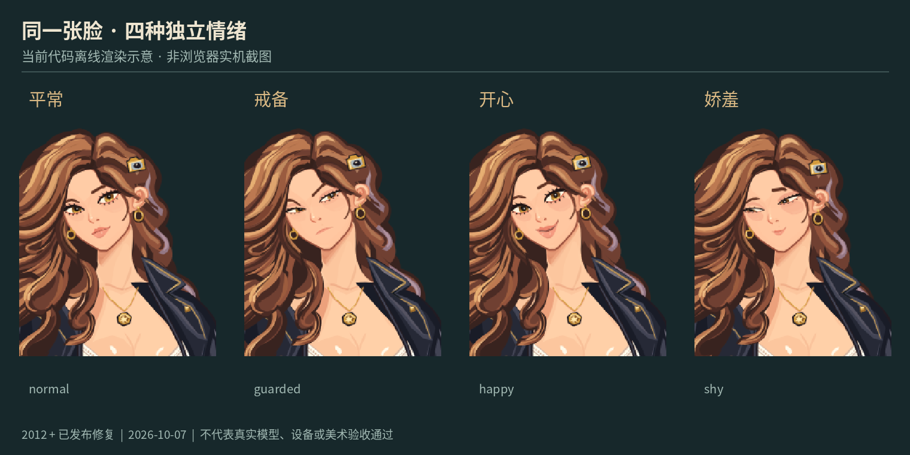

# MIRA · 雨夜咖啡馆里的实时角色互动

MIRA 是一位 26 岁的原创虚构摄影师。你可以在雨夜咖啡馆里和她打字、说话、打断回应，聊摄影、改变穿着与场景，再以老朋友「夏禾」的身份完成一次相认与赠照。角色和环境是体验主体，聊天框负责输入与辅助阅读。

本项目选择**代码驱动的角色动画**作为核心多模态能力，同时提供固定灯塔照片和可选的后台图片生成。日常对话保持角色口吻；明确问到 AI 身份、现实存在或图片来源时，她应如实说明自己是扮演 MIRA 的 AI，以及素材的真实来源。

**当前交付：2026-10-07 项目提交源码 ZIP，已整合 2012 基线、图片审核、自然对话衔接和默认同 Wi-Fi 免配对三项修补，无需再运行补丁安装器。** 包内前端由同一冻结源码编译；依赖环境另行准备。用户已确认基本聊天、固定照片，以及一次生成图的显示与主动完成通知，但反馈没有绑定精确源码摘要。完整语音、真实打断、手机和同版本完整流程尚待实机验收，演示视频随邮件另附（用户已录制，本包未包含且未代验）。历史发布、后续影响面检查和本次打包核验的范围见[验证说明](docs/submission/VERIFICATION.md)；本次未重新执行完整发布套件，未发布新的在线演示或远端仓库。

[先从这里开始](START-HERE.md) · [首次使用／升级](FIRST-RUN.md) · [提交前清单](docs/SUBMISSION-CHECKLIST.md) · [录制步骤](docs/development/DEMO-RECORDING.md) · [AI 使用说明](AI_USAGE.md) · [验证范围](docs/submission/VERIFICATION.md)

## 可以体验什么

- **实时交流**：文字与显式开启的真实麦克风输入；声音、字幕和待机／倾听／思考／说话四态。
- **可见表演**：平常、戒备、开心、娇羞四种神情；举起与放回相机；黑夹克、奶油色内搭、琥珀雨衣；相机头饰与星星发卡。
- **场景变化**：咖啡馆与雨窗。相机动作只改变角色姿态，不会拍摄用户。
- **夏禾章节**：陌生人交流 → 明确自认夏禾 → 共同挑试印的往事 → 赠照邀请 → 一次接受 → 屏内实际递照。预览照片与完成赠照分别记录。
- **后台新图**：请求一张无人物、无动物的虚构环境／静物图后继续聊天；实际显示后才自然通知一次。可分别收起固定照片、取消生成任务或停止全部。
- **无密钥体验**：本地 Mock 和带预录声音的固定排练，保留明确的离线标识。

## 当前角色与开发画面

下面前三张是**当前代码离线渲染示意**：使用同版角色组合函数和已有场景，经 SVG 光栅化制作。它们展示实际代码里的造型、服装和表情，没有模拟产品 UI，也不是浏览器／设备截图。


三套服装：黑夹克、奶油色内搭与琥珀雨衣。此图用于对照造型，不代替实际换装交互验收。


四种表情：平常、戒备、开心、娇羞。[四态固定帧](docs/images/04-current-phases.png)另供参考；静帧不能证明真实语音、口型同步或动画性能。



下面是**历史真实浏览器截图**：原文件名日期为 2026-10-04 22:54:22，时区与具体构建号未确认，使用旧 `static-pixi` 插画界面。仅裁去标签栏和开发者工具，保留“正在连接”与停止字幕；不代表本包当前运行界面或真实模型验收。


每张图的模式、尺寸、来源与摘要见[图片来源说明](docs/images/PROVENANCE.md)。

## 快速启动

在完整源码根目录操作。需要 **Python 3.11–3.13（含 venv／ensurepip）、Node.js 22.12+ 和 npm**。macOS／Linux 使用下面的命令；Windows 尚未验证。

ZIP 包含完整源码、现有素材和同版预编译 `apps/web/dist`，不包含 `.venv` 或 `node_modules`。首次准备依赖时，下面的工具使用现有 `requirements/dev.lock` 和 `package-lock.json`，需要访问 Python／npm 包注册表：

```sh
sh scripts/start --setup
```

安装完成后，使用常用入口：

```sh
sh scripts/start
```

首次选择 `1` 真实默认预设、`2` 无密钥离线排练或 `0` 取消，以后复用本目录的选择。之前选过离线时，用 `sh scripts/start --preset live` 切换真实预设。真实预设保留原 `gpt-6.1-sol`＋Fast、Google 语音、剧情、可选图片与 `gpt-6-luna` 图片审核；首次选择需确认其数据和用量范围。新用户缺少 `.env` 时只创建不含秘密的模板，已有文件不覆盖；登录、ADC 与缺项处理见[首次使用／升级](FIRST-RUN.md)。

在运行服务的电脑打开 **http://127.0.0.1:8000**。端口占用时追加 `--port 8123`；按 Ctrl+C 结束服务。普通启动检查合同、构建前端，不自动安装依赖；只有 `--setup` 显式安装，完成后须另行启动。当前默认角色为 `code-native-review`；旧全帧插画可用 `sh scripts/start -- --character-renderer static-pixi` 显式选择。

已有兼容 Python 环境可以复用，不要搬迁旧 `.venv`；新源码目录也需要自己的前端依赖入口：

```sh
sh scripts/start --python /absolute/path/to/ready/python
```

需要无密钥声音与故障排练时：

```sh
sh scripts/start --preset offline
```

页面显示 `OFFLINE · 离线排练`。可使用「你好」「不要拍我」「看照片」「照片里有什么」「讲讲旅途」「听雨」「暖灯」和 `/fail`。这条路线使用固定文本与预录 Flite/slt 英文合成声音；「按住演练输入」不录音，也不进行自由模型对话。原 Mock 入口 `sh scripts/dev` 与 `sh scripts/dev --profile rehearsal` 保留；Mock 同样不读取私密配置、不调用服务、不采集真实麦克风。

准备好依赖后可一条命令启动；全新电脑的安装耗时受工具和网络影响，**目前没有完整 ≤15 分钟安装计时证据**。

## 连接真实模型、语音和图片

常用入口 `sh scripts/start` 将选定的订阅预设交给现有 `tools/live_provider.py`，不依赖 Codex CLI。`--dry-run` 只查看最终参数，`--check` 只做本地预检；两者不启动真实服务。默认 `luna_tools` 是原生函数工具协议名称，实际对话模型由 `--model` 选择。正常路径不构造 JEV，也不需要 JEV 凭据。只有原 CLI 显式选择 `legacy_jev` 才使用旧兼容路线。

### 1. 复用配置和已有登录

保留原有私密 `.env`、Google ADC 和 **MIRA 自己的登录**。下方沿用用户原命令：项目根 `.env`、现有 Google ADC 路径，以及默认 MIRA 登录存储，不新增 `--auth-store`。只有原命令已使用自定义 MIRA 登录存储时，才继续追加原有 `--auth-store` 路径。已有有效登录无需重新 OAuth，不要复制其他应用的认证或把整份 `.env` 用 `source` 导入开发环境。首次登录与新装／升级区别见[首次使用说明](FIRST-RUN.md)。

新环境运行 `sh scripts/start --preset live` 并选择真实预设后，仅在 `.env` 不存在时复制公开 `.env.example`，以仅本人可读写权限保存；已有配置保持原样。模板带现有非秘密语音预设，Google 项目等缺项由本人填写。具体步骤见[首次使用说明](FIRST-RUN.md)和 [Google 语音配置](docs/development/GOOGLE_VOICE_CONFIGURATION.md)。配置与 ADC 须为本人拥有、仅本人可读写的普通文件。不要将密钥、认证文件、配对码或私人对话放进仓库、截图和录屏。

常用模型、Fast 等级、语音／剧情／图片开关和 ADC 路径可在 `.env` 的 `MIRAAPP_*` 字段中保存；模板已填原预设，自定义 `MIRAAPP_AUTH_STORE` 留空以保留默认登录存储。已有配置缺少这些字段时仍用原默认；明确 CLI 参数优先。预设不替代数据／用量授权，`--dry-run` 会读取这些预设来展示最终参数。字段和开关对照见[首次使用说明](FIRST-RUN.md)。

以下命令只检查 MIRA 的本机登录记录，不联网、不刷新，也不验证模型资格：

```sh
.venv/bin/python tools/provider_login.py status
```

仅当确实没有 MIRA 登录，并决定授予它独立访问时，运行下面的命令并按本机提示在官方页面完成授权：

```sh
.venv/bin/python tools/provider_login.py login
```

自选存储路径应放在子命令前，例如 `tools/provider_login.py --auth-store /absolute/private/mira-session.json status`。订阅路线使用非公开兼容后端，资格、配额与长期兼容性仍取决于服务方。

### 2. 文字＋剧情

下面沿用当前选定的 `gpt-6.1-sol` 和显式 Fast 等级。将示例路径替换为自己的现有私密配置；`--authorize-provider-data` 表示同意将对话和受控工具上下文发给所选 OpenAI 服务。

```sh
PYTHONPATH=apps/api/src .venv/bin/python tools/live_provider.py serve \
  --provider chatgpt_subscription --model gpt-6.1-sol --service-tier fast \
  --env-file /absolute/path/to/existing/.env \
  --authorize-provider-data --story
```

去掉 `--story` 可关闭作者剧情。将同一命令的 `serve` 改为 `check`，只检查所选配置及声明，不发模型请求、不读取登录存储、不打开麦克风，也不证明账户可用。`live_provider.py` 没有 `--python` 参数；复用环境时直接替换命令开头的 `.venv/bin/python`。Fast 是请求等级，不是速度或供应商实际计量保证；可用 `--service-tier standard` 明确选择 Standard。

### 3. 语音＋剧情＋可选新图

`sh scripts/start` 的真实预设来自下面这条用户已经使用的完整命令，图片审核明确选择 `gpt-6-luna`。它使用项目根 `.env` 和已有 ADC；若原文件放在别处，用入口的 `--env-file`／`--adc-file` 指定，或修改下方对应路径。运行前，须已同意对话外传、Google 的音频／文字处理和服务用量，以及图片数据、订阅用量与本轮可变虚构描述的外传范围。**已有更小限额应继续保留。** 本次打包不读取或迁移这些文件，不重新授权，也不修改系统或证书设置。

```sh
PYTHONPATH=apps/api/src .venv/bin/python tools/live_provider.py serve \
  --provider chatgpt_subscription --model gpt-6.1-sol --service-tier fast \
  --env-file .env --authorize-provider-data \
  --voice --adc-file "$HOME/.config/gcloud/application_default_credentials.json" \
  --authorize-google-voice-data-and-spend \
  --story --story-images \
  --authorize-story-image-data-to-openai \
  --authorize-story-image-subscription-usage \
  --authorize-story-image-custom-brief \
  --story-image-review-model gpt-6-luna
```

这条命令沿用原默认：`luna_tools`、TTS 20 次／每次最多 30 秒、单 STT RPC 120 秒、图片 1 个任务，不扩大额度。图片的四个启用／授权开关是 `--story-images` 和三个 `--authorize-story-image-…` 参数。只要语音＋剧情时，去掉这四个开关及 `--story-image-review-model gpt-6-luna`。`--story` 本身不会开启生图。固定灯塔照片无需图片服务调用。

在 Mac／服务电脑上仍打开 **http://127.0.0.1:8000** 使用原语音入口；手机打开终端打印的 `http://PRIVATE_IP:8000`，无需配对。普通 `serve` 默认只选唯一可确认的活动物理 Wi-Fi／以太网私网 IPv4；无法确定时打印 `WARNING` 并继续本机服务。需要指定地址时只追加 `--private-bind 192.168.2.13`（换成电脑当前地址）；只供本机则追加 `--loopback-only`，两者不要混用。

使用常用入口时，网络及有限预算参数放在分隔符后，例如 `sh scripts/start -- --private-bind 192.168.2.13`、`sh scripts/start -- --loopback-only` 或 `sh scripts/start -- --tts-requests 10`。入口只透传支持的网络、有限预算与 renderer 参数；其他路线和额外授权继续使用原 CLI。

手机 HTTP 严格只支持文字及已启用的图片功能：后端没有该会话的 STT／TTS 端口，不能通过声音偏好或 WebSocket 开启语音。手机语音须使用已经配置并由两端信任的 HTTPS；原有 TLS 参数和语音授权见[设备指南](docs/development/PRIVATE-DEVICE-TESTING.md)。手动配对是可选路线，须配置 `--require-device-pairing`、`--device-pairing-dir` 和精确 `--device-origin`；HTTP 配对同样不支持语音。

图片路线接收已释放的虚构场景说明；独立读图路线接收规范化 PNG、绑定信息与审核标准。可变描述限 600 字符，只支持无人、无动物的环境或静物，不附加完整对话、私有记忆、参考图、URL 或文件路径。不要在描述里提供私人资料。订阅图片请求为 `gpt-image-2`／`auto`；默认独立读图模型跟随所选对话模型，也可显式用 `--story-image-review-model` 指定已获准的模型。

官方 API 是另行选择的路线，需要自己的 API 配置及计费同意；不会由订阅失败自动切入：

```sh
PYTHONPATH=apps/api/src .venv/bin/python tools/live_provider.py serve \
  --provider openai_api --model YOUR_API_MODEL \
  --env-file /absolute/path/to/existing/.env \
  --authorize-provider-data --authorize-api-billing --story
```

### 当前默认预算

| 项目 | 默认与边界 |
|---|---|
| 订阅文字 | 本机模型请求次数、文字轮数不设上限；`--generation-requests N`、`--turns N` 可选有限值 |
| 连续聆听／Google STT | 本机时长、发送、启动、续接和共享 STT 请求次数默认不设上限；单识别 RPC 最多 120 秒，可续接 |
| Google TTS | 每进程 20 次，每次最多 30 秒 |
| 新图 | 每进程 1 个任务；一次生成＋至多一次独立读图，不自动重试 |
| 官方 API 文字 | 默认 20 次生成、20 轮 |

无需追加 `--local-unlimited`。本机不限不代表免费，也不取消供应商配额、超时、并发或队列限制。Google 持续识别会继续产生用量，直到用户停止或服务限制／故障终止。有限参数仍可通过 `--stt-requests`、`--listen-max-seconds`、`--listen-max-utterances` 等设置，完整选项见 `serve --help`。

普通聊天通常一次模型请求；工具轮至多一个工具和两次模型请求。图片实际显示后的完成通知还可能使用一次无工具模型续答及原有 TTS 额度。失败／取消不退有限计数；重启只重置本机计数，这些值不是账户账本或金额硬上限。

同一可信私人网络内能访问地址的人可能消耗已启用的额度。所有入口共享同一个 provider runtime 和原有预算，**16 个独立临时浏览器会话是资源上限，不是 provider 请求额度，也不会按设备增加 TTS 20 次或图片 1 次的额度**。`--memory-db`、`--story-db`、`--conversation-db` 持久模式保留原本机单操作者及配对边界，不会默认开放 LAN；普通 `--story` 是临时剧情。

## 语音和打断怎样工作

1. 用户在浏览器点击「开始自然对话」并允许麦克风，音频送到 Google STT；临时转写只作预览。
2. 本地检测到有效说话后约 700 毫秒安静，进入有界收尾；合格最终转写才提交一轮。文字也可随时输入。
3. 服务端生成完整候选与受控工具请求；确认可执行的内容交给前端。Google TTS 提供声音，字幕与角色四态配合呈现。
4. 默认开启语音插话：新声音活动可先在本地停旧声音和待播内容，再提交新输入。旧结果不得在后续回合复活。按钮「打断回应，继续听我说」保留麦克风；全局 Stop／关闭会释放麦克风并停止相关未完成任务。

选择“本地先停＋服务端取消／版本校验”，是为了让用户夺回话轮时不必等待网络。显式打断按钮提供可理解的兜底；另外保留保守的重叠语音手动确认模式。当前音量／时间启发式没有可靠说话人识别或声学回声消除，建议使用耳机；实际声尾、误触发和新输入处理仍需真机验证。字幕采用本地确定性边界，不额外调用 JEV；口部运动是状态动画，尚未实现音素同步。

「静音回应」会关闭回应声音并继续显示文字，麦克风可继续聆听；「开启回应声音」从后续回合恢复。它提供主动文字降级入口，不等于已经验证音频服务故障恢复。

普通输入或回复级打断保留已经接受的后台图片任务；精确取消只处理指定图片／任务。全局 Stop 的范围更大。已真实呈现的状态与可靠用户输入会保留，未呈现的旧输出不能被当作已发生。

## 角色指令与系统结构

模型提出动作，应用核对参数、当前素材、状态前提与数据／用量许可，浏览器实际绘制后返回呈现回执。对白里的“已经给你了”不能代替动作完成。

| 互动目的 | 结构化工具／参数 |
|---|---|
| 看灯塔照片 | `show_photo(photo_id=trip_photo)` |
| 换衣／头饰 | `set_outfit`：`black_jacket`、`cream_inner_only`、`amber_raincoat`；`set_accessory`：`camera_clip`、`star_clip` |
| 表情／动作 | `set_emotion`：`normal`、`guarded`、`happy`、`shy`；`perform_action`：`raise_camera`、`return_camera` |
| 场景 | `set_scene`：`cafe`、`rain_window` |
| 有限剧情 | `advance_story`：相认、往事、邀请、接受／拒绝等，受当前章节状态约束 |
| 可选新图 | `generate_story_image`；有当前任务时才提供对应 `cancel_story_image` |

工具能力会随模式、预算和当前状态变化。夏禾是用户选择的虚构角色，不是现实身份认证。共同往事由作者预设；灯塔是 MIRA 独自拍摄的角色故事，二人的共同经历是回到咖啡馆挑试印。

| 模块 | 作用 |
|---|---|
| `apps/web/src` | TypeScript 前端：场景与代码角色、音频／字幕、输入、停止与呈现回执 |
| `apps/api/src/mira/entrypoints/http` | FastAPI／WebSocket 入口、会话与设备配对 |
| `apps/api/src/mira/application` | 会话 Actor、工具执行、后台图片、语音及取消调度 |
| `apps/api/src/mira/domain` | 状态、剧情、邀请与实际呈现事实，独立于 HTTP／服务 SDK |
| `apps/api/src/mira/adapters`、`bootstrap` | OpenAI／Google／存储适配器与显式组装 |
| `tools`、`tests`、`specs` | 启动与恢复工具、分块离线检查、行为规格 |

完整链路为：浏览器文字／语音 → 会话 Actor → 所选模型与有限工具 → 状态和许可检查 → 音频／字幕／角色／图片 → 呈现回执 → 下一轮上下文。原始对话和音频录制默认关闭；本地记忆、会话档案与角色存档分别显式启用，不自动保存或学习人格。

## 技术选择、模型与素材

| 选择 | 用途与取舍 |
|---|---|
| TypeScript＋代码原生角色；保留 PixiJS 回退 | 同一组可编辑部件表达衣装、情绪和动作，便于取消；造型、动作幅度和口型仍有限 |
| Python＋FastAPI／WebSocket＋单会话 Actor | 把状态、取消和真实呈现放在同一控制流程；当前面向本地体验，尚未作为多用户线上服务验收 |
| OpenAI 订阅直连；官方 API 显式备用 | 本次示例为 `gpt-6.1-sol`＋Fast；无自动换模型、重试或付费回退 |
| Google STT V2 `chirp_3`＋`gemini-3.8-flash-tts` | 真实识别与合成分开，便于控制输入和播放；需要 Google 配置、ADC 与用量授权 |
| 固定素材＋可选 `gpt-image-2` | 固定照片使主要章节无需等生图；新图异步生成，失败时保留其他聊天能力 |

默认角色由代码绘制。咖啡馆、固定灯塔插画和历史角色 PNG 的 AI 辅助原创来源见[素材说明](apps/web/public/scene/ORIGINAL-ASSETS.md)及 [AI_USAGE](AI_USAGE.md)。离线声音为本地 Flite/slt 合成输出。主要依赖、许可证和第三方通知见[来源清单](docs/development/ATTRIBUTION-INVENTORY.md)与[第三方通知](docs/development/third-party-notices/README.md)；本说明不替项目选择整体开源许可证。

## 已验证与待完成

本次保留了 2012 的历史 13-lane 完整离线发布收据，以及三项后续修补各自的影响面证据。默认 LAN 的最终汇总曾在 providers 约 98% 时中断：保留十个已成功检查块，并只补跑 providers（4523 项通过）；这不是本次完整 release 重跑。另有两名 AI 代理参与的 5 次独立运行、共 63 条自然输入：使用真实生产提示，程序工具与编译前端回执实际执行，外部 provider、图片和 TTS 使用模拟。它们不等于真实 `gpt-6.1-sol` 订阅／付费服务、声音或设备验收。本次核对恢复来源、编译产物、启动参数、文档与归档完整性；详细来源、独立复核和范围见[验证说明](docs/submission/VERIFICATION.md)。

| 当前状态／问题 | 下一步 |
|---|---|
| 基本聊天、固定照片、一次生成图与主动通知有用户确认；未绑定精确源码摘要 | 录制时记录实际版本、命令和设备，复核完整主线 |
| 语音链路、自动／手动打断有实现和离线证据；完整可听回复、声尾与回声未完成同版本实测 | 戴耳机实录：说话中插话、继续听、新一轮回复、迟到不复活 |
| 三衣装、情绪和场景具备软件路径；整体美术、自然度及移动端仍待验收 | 实际录到至少三种可辨表情、两种非说话状态和一次环境变化 |
| 手机语音需要已受信任的 HTTPS；私网默认免配对，也可显式要求人工配对。窄视口截图不能证明手机麦克风可用 | 按[双设备指南](docs/development/PRIVATE-DEVICE-TESTING.md)做真实手机检查 |
| 生图资格、时延和审核仍受外部服务影响；审核合格不代表角色已理解全部像素细节 | 保留实际失败反馈，核对显示后的单次通知，不从描述臆测画面 |
| 用户已录制视频并将随邮件另附；本包未收录、未代验。全新安装计时和最新远端仓库仍待确认 | 对照[录制指南](docs/development/DEMO-RECORDING.md)检查视频内容，在提交清单登记实际文件／地址 |
| 音素口型、可靠声学回声消除、完整长期人格学习未完成 | 后续按体验价值逐项推进，不列为当前完成能力 |

## 投入时间与再开发两周

作者按**包含 AI 运行时间**的口径粗估总投入约 **100 小时**：设计 5、后端 30、人物 30、整合 10、返工与路线变动 20、测试 5 小时。这是各部分的粗略投入统计，不是个人工作 100 小时，也不代表连续 100 小时的开发周期。可核对的迭代记录覆盖 2026-10-03 至 2026-10-07；完整第一人称复盘见 [AI_USAGE](AI_USAGE.md)。

如继续开发两周，建议先完成当前体验验收，再扩大能力：

- **第 1–3 天**：冻结版本，补齐桌面／手机语音、打断与故障恢复实测；记录首轮延迟、声尾和实际服务用量。
- **第 4–7 天**：依据录屏修正表情可辨性、动作衔接、字幕节奏与语音误触发，优先解决主线阻塞。
- **第 8–10 天**：完善图片排队／取消反馈和模型理解图片的明确边界；改善剧情岔开话题与拒绝后的自然衔接。
- **第 11–14 天**：做干净安装计时、设备回归与长会话检查，补齐素材来源、可重复录制和最终发布收据。

这是演进建议，不是已完成工作或交付日期承诺。
